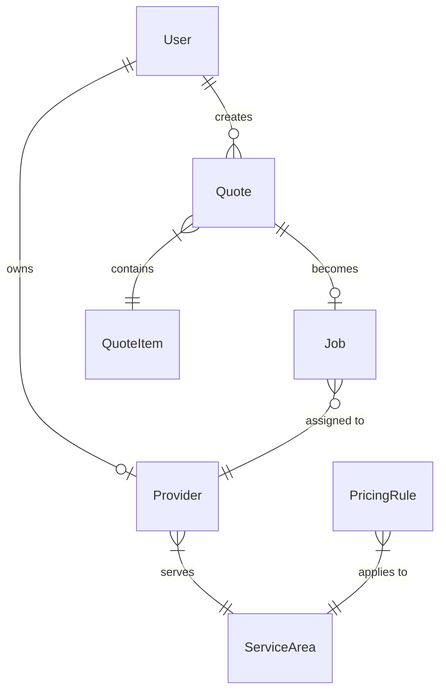

# Database Schema Design

## Overview

PostgreSQL database with the following core entities:
- Users (Customers & Providers)
- Quotes
- Jobs
- Providers
- Service Areas
- Pricing Rules

## Entity Relationship Diagram



## Schema Definition

### Users Table
```sql
CREATE TABLE users (
    id UUID PRIMARY KEY DEFAULT gen_random_uuid(),
    email VARCHAR(255) UNIQUE NOT NULL,
    phone VARCHAR(20),
    name VARCHAR(255),
    role ENUM('customer', 'provider', 'admin') DEFAULT 'customer',
    email_verified TIMESTAMP,
    phone_verified TIMESTAMP,
    created_at TIMESTAMP DEFAULT NOW(),
    updated_at TIMESTAMP DEFAULT NOW()
);

CREATE INDEX idx_users_email ON users(email);
CREATE INDEX idx_users_phone ON users(phone);
CREATE INDEX idx_users_role ON users(role);
```

### Providers Table
```sql
CREATE TABLE providers (
    id UUID PRIMARY KEY DEFAULT gen_random_uuid(),
    user_id UUID REFERENCES users(id) ON DELETE CASCADE,
    business_name VARCHAR(255) NOT NULL,
    business_address TEXT,
    business_phone VARCHAR(20),
    license_number VARCHAR(100),
    insurance_info JSONB,
    rating DECIMAL(3,2) DEFAULT 0,
    total_jobs INTEGER DEFAULT 0,
    status ENUM('pending', 'active', 'suspended') DEFAULT 'pending',
    payment_terms JSONB, -- {lead_price, billing_cycle, payment_method}
    capabilities JSONB, -- {truck_sizes, special_items, same_day}
    operating_hours JSONB,
    created_at TIMESTAMP DEFAULT NOW(),
    updated_at TIMESTAMP DEFAULT NOW()
);

CREATE INDEX idx_providers_status ON providers(status);
CREATE INDEX idx_providers_rating ON providers(rating);
```

### Service Areas Table
```sql
CREATE TABLE service_areas (
    id UUID PRIMARY KEY DEFAULT gen_random_uuid(),
    provider_id UUID REFERENCES providers(id) ON DELETE CASCADE,
    zip_code VARCHAR(10),
    city VARCHAR(100),
    state VARCHAR(2),
    country VARCHAR(2) DEFAULT 'US',
    max_radius_miles INTEGER DEFAULT 25,
    is_primary BOOLEAN DEFAULT false,
    created_at TIMESTAMP DEFAULT NOW()
);

CREATE INDEX idx_service_areas_zip ON service_areas(zip_code);
CREATE INDEX idx_service_areas_location ON service_areas(city, state);
```

### Quotes Table
```sql
CREATE TABLE quotes (
    id UUID PRIMARY KEY DEFAULT gen_random_uuid(),
    user_id UUID REFERENCES users(id),
    status ENUM('draft', 'pending', 'sent', 'accepted', 'expired') DEFAULT 'draft',

    -- Customer Info
    customer_name VARCHAR(255),
    customer_email VARCHAR(255),
    customer_phone VARCHAR(20),

    -- Location
    pickup_address TEXT,
    pickup_zip VARCHAR(10),
    pickup_city VARCHAR(100),
    pickup_state VARCHAR(2),

    -- Quote Details
    photo_urls JSONB, -- Array of S3/Cloudinary URLs
    ai_analysis JSONB, -- {items_detected, confidence, categories}

    -- Pricing
    estimated_volume ENUM('quarter', 'half', 'three_quarter', 'full', 'multiple'),
    base_price DECIMAL(10,2),
    additional_fees JSONB, -- {heavy_items, stairs, long_carry}
    total_price DECIMAL(10,2),
    price_range_min DECIMAL(10,2),
    price_range_max DECIMAL(10,2),

    -- Scheduling
    preferred_date DATE,
    preferred_time_window VARCHAR(50),
    is_urgent BOOLEAN DEFAULT false,

    -- Metadata
    source VARCHAR(50), -- 'web', 'mobile', 'widget', 'sms'
    utm_params JSONB,
    ip_address INET,
    user_agent TEXT,

    created_at TIMESTAMP DEFAULT NOW(),
    expires_at TIMESTAMP DEFAULT (NOW() + INTERVAL '7 days'),
    updated_at TIMESTAMP DEFAULT NOW()
);

CREATE INDEX idx_quotes_status ON quotes(status);
CREATE INDEX idx_quotes_user ON quotes(user_id);
CREATE INDEX idx_quotes_zip ON quotes(pickup_zip);
CREATE INDEX idx_quotes_created ON quotes(created_at DESC);
```

### Quote Items Table
```sql
CREATE TABLE quote_items (
    id UUID PRIMARY KEY DEFAULT gen_random_uuid(),
    quote_id UUID REFERENCES quotes(id) ON DELETE CASCADE,
    item_type VARCHAR(100), -- 'couch', 'mattress', 'appliance', etc.
    item_description TEXT,
    quantity INTEGER DEFAULT 1,
    ai_confidence DECIMAL(3,2),
    requires_special_handling BOOLEAN DEFAULT false,
    estimated_weight_lbs INTEGER,
    dimensions JSONB, -- {length, width, height}
    created_at TIMESTAMP DEFAULT NOW()
);

CREATE INDEX idx_quote_items_quote ON quote_items(quote_id);
```

### Jobs Table
```sql
CREATE TABLE jobs (
    id UUID PRIMARY KEY DEFAULT gen_random_uuid(),
    quote_id UUID REFERENCES quotes(id),
    provider_id UUID REFERENCES providers(id),
    status ENUM('pending', 'confirmed', 'in_progress', 'completed', 'cancelled') DEFAULT 'pending',

    -- Scheduling
    scheduled_date DATE,
    scheduled_time VARCHAR(50),
    actual_start_time TIMESTAMP,
    actual_end_time TIMESTAMP,

    -- Pricing
    final_price DECIMAL(10,2),
    provider_payout DECIMAL(10,2),
    platform_fee DECIMAL(10,2),

    -- Completion Details
    completion_photos JSONB,
    customer_signature VARCHAR(255),
    notes TEXT,

    -- Ratings
    customer_rating INTEGER,
    customer_review TEXT,
    provider_rating INTEGER,
    provider_feedback TEXT,

    created_at TIMESTAMP DEFAULT NOW(),
    updated_at TIMESTAMP DEFAULT NOW()
);

CREATE INDEX idx_jobs_status ON jobs(status);
CREATE INDEX idx_jobs_provider ON jobs(provider_id);
CREATE INDEX idx_jobs_scheduled ON jobs(scheduled_date);
```

### Lead Distribution Table
```sql
CREATE TABLE lead_distribution (
    id UUID PRIMARY KEY DEFAULT gen_random_uuid(),
    quote_id UUID REFERENCES quotes(id),
    provider_id UUID REFERENCES providers(id),
    status ENUM('sent', 'viewed', 'accepted', 'declined', 'expired') DEFAULT 'sent',
    sent_at TIMESTAMP DEFAULT NOW(),
    viewed_at TIMESTAMP,
    responded_at TIMESTAMP,
    response_reason TEXT,
    bid_amount DECIMAL(10,2), -- For auction model
    is_winner BOOLEAN DEFAULT false,
    created_at TIMESTAMP DEFAULT NOW()
);

CREATE INDEX idx_lead_dist_quote ON lead_distribution(quote_id);
CREATE INDEX idx_lead_dist_provider ON lead_distribution(provider_id);
CREATE INDEX idx_lead_dist_status ON lead_distribution(status);
```

### Pricing Rules Table
```sql
CREATE TABLE pricing_rules (
    id UUID PRIMARY KEY DEFAULT gen_random_uuid(),
    name VARCHAR(255),
    description TEXT,

    -- Location Scope
    zip_code VARCHAR(10),
    city VARCHAR(100),
    state VARCHAR(2),
    is_default BOOLEAN DEFAULT false,

    -- Base Pricing (per truck load)
    quarter_truck_price DECIMAL(10,2),
    half_truck_price DECIMAL(10,2),
    three_quarter_truck_price DECIMAL(10,2),
    full_truck_price DECIMAL(10,2),

    -- Additional Fees
    heavy_item_fee DECIMAL(10,2),
    stairs_fee DECIMAL(10,2),
    long_carry_fee DECIMAL(10,2),
    same_day_fee DECIMAL(10,2),
    weekend_fee DECIMAL(10,2),

    -- Multipliers
    peak_time_multiplier DECIMAL(3,2) DEFAULT 1.0,
    holiday_multiplier DECIMAL(3,2) DEFAULT 1.5,

    priority INTEGER DEFAULT 0,
    is_active BOOLEAN DEFAULT true,
    created_at TIMESTAMP DEFAULT NOW(),
    updated_at TIMESTAMP DEFAULT NOW()
);

CREATE INDEX idx_pricing_location ON pricing_rules(state, city, zip_code);
CREATE INDEX idx_pricing_active ON pricing_rules(is_active, priority DESC);
```

### Analytics Events Table
```sql
CREATE TABLE analytics_events (
    id UUID PRIMARY KEY DEFAULT gen_random_uuid(),
    event_type VARCHAR(100), -- 'page_view', 'quote_started', 'quote_completed', etc.
    user_id UUID REFERENCES users(id),
    session_id VARCHAR(255),

    -- Event Data
    event_data JSONB,
    page_url TEXT,
    referrer TEXT,

    -- Device/Location
    ip_address INET,
    user_agent TEXT,
    device_type VARCHAR(50),
    browser VARCHAR(50),
    os VARCHAR(50),
    country VARCHAR(2),
    region VARCHAR(100),
    city VARCHAR(100),

    created_at TIMESTAMP DEFAULT NOW()
);

CREATE INDEX idx_analytics_type ON analytics_events(event_type);
CREATE INDEX idx_analytics_user ON analytics_events(user_id);
CREATE INDEX idx_analytics_session ON analytics_events(session_id);
CREATE INDEX idx_analytics_created ON analytics_events(created_at DESC);
```

## Indexes for Performance

### Geospatial Queries
```sql
-- Add PostGIS extension for location-based queries
CREATE EXTENSION IF NOT EXISTS postgis;

ALTER TABLE service_areas ADD COLUMN location GEOGRAPHY(POINT);
ALTER TABLE quotes ADD COLUMN pickup_location GEOGRAPHY(POINT);

CREATE INDEX idx_service_areas_geo ON service_areas USING GIST(location);
CREATE INDEX idx_quotes_geo ON quotes USING GIST(pickup_location);
```

### Full-Text Search
```sql
-- For searching quotes and jobs
ALTER TABLE quotes ADD COLUMN search_vector tsvector;
UPDATE quotes SET search_vector = to_tsvector('english',
    coalesce(customer_name, '') || ' ' ||
    coalesce(pickup_address, '') || ' ' ||
    coalesce(ai_analysis::text, '')
);

CREATE INDEX idx_quotes_search ON quotes USING GIN(search_vector);
```

## Migration Strategy

### Initial Setup
1. Create database and user
2. Run migrations in order
3. Seed initial data (pricing rules, admin user)

### Version Control
- Use Prisma migrations for schema changes
- Keep migration files in version control
- Document breaking changes

### Backup Strategy
- Daily automated backups
- Point-in-time recovery enabled
- Test restore procedures monthly