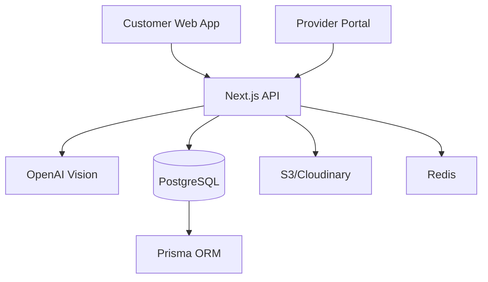

# Technology Stack & Architecture

## Architecture Overview



## Core Technologies

### Frontend Stack

#### Next.js 14+ (App Router)
- **Why:** Server-side rendering for SEO, built-in API routes, excellent DX
- **Features:** App Router, Server Components, Streaming
- **Version:** 14.x

#### TypeScript
- **Why:** Type safety, better IDE support, fewer runtime errors
- **Config:** Strict mode enabled
- **Version:** 5.x

#### Tailwind CSS
- **Why:** Utility-first, mobile-responsive, fast development
- **Config:** Custom theme with brand colors
- **Version:** 3.x

#### shadcn/ui
- **Why:** Accessible, customizable, copy-paste components
- **Components:** Form, Button, Dialog, Upload, Card

### Backend Stack

#### PostgreSQL
- **Why:** Relational data, ACID compliance, PostGIS for geo queries
- **Hosting:** Supabase/Neon for serverless
- **Version:** 14+

#### Prisma ORM
- **Why:** Type-safe database queries, migrations, great DX
- **Features:** Schema management, type generation
- **Version:** 5.x

#### NextAuth.js
- **Why:** Flexible auth, multiple providers, session management
- **Providers:** Email/Password, Google, Phone (Twilio)
- **Version:** 5.x

### AI/ML Stack

#### OpenAI Vision API
- **Model:** GPT-4 Vision
- **Use Case:** Analyze junk photos, identify items
- **Fallback:** Manual review queue

#### Future: Roboflow
- **Why:** Custom trained models for better accuracy
- **Timeline:** V2 implementation

### Infrastructure

#### Vercel
- **Why:** Next.js native, edge functions, great DX
- **Features:** Preview deployments, analytics, monitoring

#### AWS S3 / Cloudinary
- **Why:** Image storage, CDN, transformations
- **Use Case:** Store customer photos, optimize delivery

#### Redis (Upstash)
- **Why:** Caching, rate limiting, session storage
- **Features:** Serverless, edge-compatible

## Service Integrations

### Payment Processing
- **Stripe:** Customer deposits, provider billing
- **Features:** Connect for marketplace, subscriptions

### Communications
- **Twilio:** SMS notifications, phone verification
- **SendGrid:** Transactional emails

### Monitoring & Analytics
- **Sentry:** Error tracking, performance monitoring
- **Vercel Analytics:** Web vitals, user analytics
- **PostHog:** Product analytics, feature flags

## Development Tools

### Code Quality
- **ESLint:** Code linting
- **Prettier:** Code formatting
- **Husky:** Git hooks
- **lint-staged:** Pre-commit checks

### Testing
- **Jest:** Unit testing
- **React Testing Library:** Component testing
- **Playwright:** E2E testing
- **MSW:** API mocking

### CI/CD
- **GitHub Actions:** Automated testing, deployment
- **Vercel:** Preview & production deployments

## Environment Configuration

### Required Environment Variables

```env
# Database
DATABASE_URL=
DIRECT_URL=

# Auth
NEXTAUTH_URL=
NEXTAUTH_SECRET=

# OpenAI
OPENAI_API_KEY=

# Storage
AWS_ACCESS_KEY_ID=
AWS_SECRET_ACCESS_KEY=
AWS_REGION=
AWS_BUCKET_NAME=

# Stripe
STRIPE_SECRET_KEY=
STRIPE_PUBLISHABLE_KEY=
STRIPE_WEBHOOK_SECRET=

# Communications
TWILIO_ACCOUNT_SID=
TWILIO_AUTH_TOKEN=
SENDGRID_API_KEY=

# Monitoring
SENTRY_DSN=
```

## Performance Targets

- **First Contentful Paint:** < 1.2s
- **Time to Interactive:** < 2.5s
- **AI Quote Response:** < 3s
- **API Response Time:** < 200ms (p95)
- **Uptime:** 99.9%

## Security Considerations

- **Authentication:** JWT with refresh tokens
- **Authorization:** Role-based access control
- **Data Protection:** Encryption at rest and in transit
- **PII Handling:** GDPR/CCPA compliance
- **Rate Limiting:** API and upload limits
- **Input Validation:** Zod schemas throughout

## Scalability Plan

### Phase 1 (MVP)
- Single region deployment
- Shared database
- Basic caching

### Phase 2 (Growth)
- Multi-region deployment
- Read replicas
- CDN for assets
- Queue-based processing

### Phase 3 (Scale)
- Microservices architecture
- Dedicated AI service
- Global edge deployment
- Real-time bidding system